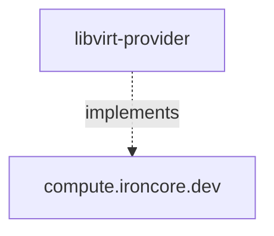

# Libvirt Provider 

The `libvirt-provider` project is a Libvirt based provider implementation of the [ironcore](https://github.com/ironcore-dev/ironcore) types

Namely `libvirt-provider` implements the [`Machine`](https://github.com/ironcore-dev/ironcore/blob/main/api/compute/v1alpha1/machine_types.go) type.
Additionally, it announces the available `MachineClasses` which are supported by the `MachinePool` based on configured
criteria.

Further information about the architecture and concepts of the `libvirt-provider` project can be found in the
[architecture](/architecture) section.
