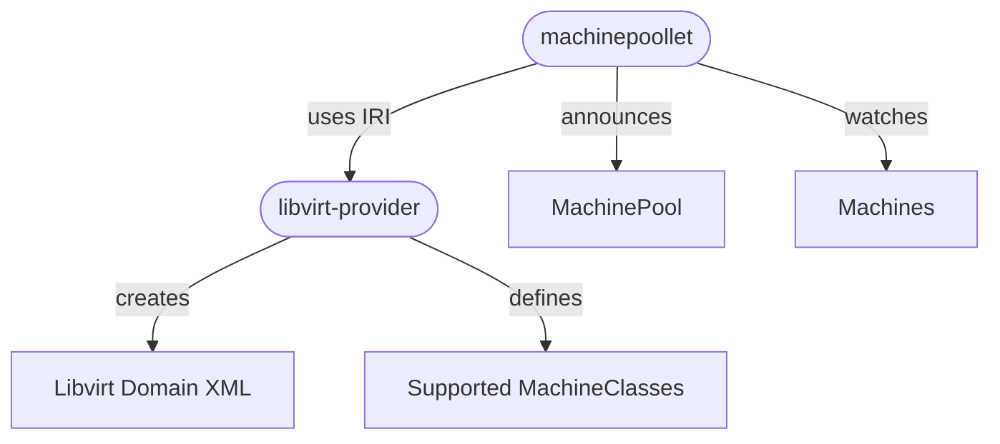

# Architecture

This section covers the core concepts of the `libvirt-provider` project.

The `libvirt-provider` is an implementor of the `ironcore runtime interface` (`IRI`) for `Machines`, it implements the [MachineRuntime](https://github.com/ironcore-dev/ironcore/blob/main/iri/apis/machine/v1alpha1/api.proto#L17-L33)

A `libvirt-provider` is usually deployed along with a [poollet](https://github.com/ironcore-dev/ironcore/tree/main/poollet).
A poollet resolves dependencies, e.g. a secrets, and calls with the consolidated resource the `libvirt-provider`. 
The `libvirt-provider` persists the required state and reconciles the resource in an asynchronous manner. 

The `libvirt-provider` interacts directly with a defined `libvirt` instance on the host. 
A `Machine` is provisioned by creating a `domain xml`. If needed, images are downloaded, NICs are configured and volumes are attached.

The following diagram visualizes the interplay of the different components: 

